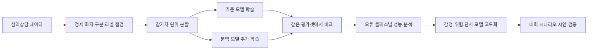

# HOP Biohealth AI Challenge

**심리상담 데이터 기반 모델 학습·평가 — 상담 맥락 분류에서 환자의 감정·위험 단서 분석까지**

이 프로젝트는 **심리상담 데이터를 정제하고 AI 모델을 학습·비교하여, 상담 대화의 맥락과 상태 단서를 분석하는 기술을 개발**합니다. 전체 상담 회기와 발화·문단·단어 수준의 정보를 연결하고, 참가자 단위로 분리한 데이터에서 모델의 일반화 성능을 검증합니다.

핵심 산출물은 **학습 데이터 구성, 기준 모델과 추가 학습 모델, 동일 조건의 비교 실험, 오류 분석과 재현 가능한 평가 기록**입니다. 이를 바탕으로 환자의 감정·위험 단서를 구조화하고 대화 응답에 반영하는 모델로 확장합니다. ‘말씨’ 웹앱과 백엔드는 이 모델을 실제 대화 흐름에서 시험하고 결과를 시연하는 환경입니다.

## 1. 대회 배경과 프로젝트의 데이터 선택

HOP(HIRA, Open AI Hub, Private) Biohealth AI Challenge는 보건의료 데이터를 분석하고 AI 모델을 개발·고도화하는 문제 해결형 경진대회입니다. 대회는 HIRA 공공 청구자료, 민간 임상 영상, 심리상담 및 경구약제 관련 자료 등을 다루며, 공공 빅데이터 교육·SAS 실습·전문가 멘토링을 통해 결과물을 발전시키는 프로그램으로 운영됩니다. [대회 모집 안내](https://biohealth.smu.ac.kr/biohealth/board/notice.do?articleNo=768429&mode=view), [2026-10-08 캠프 보도](https://www.newsis.com/view/NISX20261008_0003819220)

**우리 프로젝트가 선택한 핵심 데이터는 심리상담 데이터입니다.** 대회 전체의 데이터 분야와 이 프로젝트에서 실제 사용하는 데이터를 구분합니다. 상담 대화의 언어적 특성과 제공 라벨을 활용해 학습 데이터를 구성하고, 모델이 어떤 단서를 학습하며 새로운 상담 참여자에게도 일반화하는지 평가합니다.

주요 연구 질문은 다음과 같습니다.

- 상담 전체의 맥락을 보존하는 학습이 짧은 발화·표현만 사용하는 방식보다 분류에 도움이 되는가?
- 사전학습 언어모델을 상담 데이터로 추가 학습했을 때 기준 모델보다 성능이 개선되는가?
- 특정 단어, 화자 또는 데이터 출처에 의존하는 오류를 어떻게 줄일 수 있는가?
- 상담 분류 결과를 감정·위험 단서 평가와 대화 지원으로 확장하려면 어떤 추가 라벨과 검증이 필요한가?

## 2. 심리상담 데이터 구성과 전처리

활용 자료는 상담자·내담자의 대화와 라벨 정보를 포함하는 **AI Hub 심리상담 데이터**입니다. 데이터의 우울·불안·중독·일반군 구분을 바탕으로 상담 맥락을 학습합니다. 데이터의 원래 정의와 이용 조건은 [AI Hub 공식 설명](https://aihub.or.kr/aihubdata/data/view.do?aihubDataSe=data&currMenu=&dataSetSn=71806&topMenu=)을 기준으로 확인합니다.

| 데이터 단위 | 활용 목적 | 처리 원칙 |
| --- | --- | --- |
| 전체 상담 회기 | 대화 맥락을 반영한 분류·문맥 모델 학습 | 화자와 발화 순서를 보존 |
| 발화·문단 | 국소적인 상태 단서와 맥락 변화 분석 | 원래 회기·참가자·위치와 연결 |
| 단어·짧은 표현 | 어휘 기반 기준선과 오류·특징 분석 | 파생 표현을 독립적인 환자 표본으로 세지 않음 |
| 제공 요약·태그 | 별도 요약·세부 단서 과제 검토 | 코드 의미와 원문 근거를 확인한 뒤 사용 |

전처리는 화자 구분, 비식별 표기 유지, 중복·형식 오류 점검, 라벨 불일치 기록, 회기와 파생 조각의 연결을 중심으로 수행합니다. 원래 제공된 라벨과 자동 생성·규칙 기반 라벨의 출처를 구분합니다.

회기 라벨을 상속한 발화·단어는 **약한 라벨**을 가진 학습 자료입니다. 각 표현에 독립적인 임상 정답이 부여되었다고 가정하지 않습니다. 데이터 버전별 범주 ID 매핑을 확인하고, 참가자 ID·정답 라벨·출처 메타데이터를 모델 입력 문장에 섞지 않습니다.

### 참가자 단위 학습·검증 분리

현재 정리된 **회기 단위 모델 개발 패키지**의 분할은 다음과 같습니다. 대회 전체 제공 규모나 다른 파생 데이터 파일의 행 수와는 별개입니다.

| 분할 | 상담 회기 | 참가자 | 용도 |
| --- | ---: | ---: | --- |
| 학습 | 1,127 | 157 | 모델 학습 및 참가자 단위 5-fold 교차검증 |
| 개발 검증 | 198 | 28 | 전체 학습 모델 비교·오류 분석 |
| 기존 시험 | 176 | 24 | 과거 평가에 사용된 자료로 별도 보존 |

동일 참가자의 회기와 그 회기에서 파생한 문단·발화·단어는 같은 분할에 둡니다. 합성 데이터는 실제 데이터와 구분하여 학습 혼합 비율을 비교하고, 실제 검증셋에는 섞지 않습니다. 기존 시험셋은 이미 평가에 사용한 이력이 있으므로 새로운 미관측 시험셋으로 다시 소개하지 않습니다.

## 3. 모델 학습과 비교 실험

| 실험 축 | 학습·검증 내용 |
| --- | --- |
| 어휘 기반 기준선 | 문자 TF-IDF 기반 선형 분류기로 비교 기준 확보 |
| 문맥 모델 | KLUE RoBERTa-large를 상담 데이터로 추가 학습하고 대화 조각의 정보를 집계 |
| 학습 조건 | 입력 범위, 클래스 가중치, seed, 실제·합성 데이터 비율의 영향 비교 |
| 생성형 모델 확장 | 사전학습 언어모델의 상담 과제 적용과 미세조정 파일럿 비교 |
| 모델 선택 | 동일 분할·평가 단위에서 성능, 클래스별 재현율, 자원 비용을 함께 검토 |

모델 이름이나 크기만으로 우수성을 판단하지 않고, **학습 데이터와 평가 조건을 고정한 비교**를 우선합니다. 학습 범위나 입력 길이가 다른 실험은 별도로 표시하고, 전체 학습·단일 fold·소규모 파일럿 결과를 같은 순위표에 섞지 않습니다.

### 확인된 상담 분류 학습 결과

아래는 **2026-10-08에 보존한 내부 개발·검증 기록**입니다. Macro-F1은 우울·불안·중독·일반의 상담 회기 분류 지표이며, 환자의 진단 정확도나 위험 예측 성능을 뜻하지 않습니다.

| 평가 조건 | 문자 TF-IDF 기준선 | KLUE RoBERTa-large attention64 |
| --- | ---: | ---: |
| 참가자 분리 5-fold OOF — 1,127회기·157명 | 0.7915 | **0.8374** |
| 전체 학습 후 기존 개발셋 — 198회기·28명 | 0.8087 | **0.8287** |

OOF는 각 fold에서 학습에 사용하지 않은 참가자를 예측해 합친 결과입니다. 개발 과정에서 이 평가를 사용했으므로 공식 대회 점수나 독립 외부 평가 결과로 표시하지 않습니다. 기존 개발셋에서 관측한 차이의 참가자 대응 95% 신뢰구간은 0을 포함하므로, 그 비교만으로 일반화 성능 개선을 확정하지 않습니다.

학습 체크포인트·예측·실험 설정·상세 보고서는 별도 인계 자료로 보존합니다. 여기의 상담 분류 모델과 현재 백엔드의 생성형 서빙 모델은 별도 구성입니다.

## 4. 평가 기준과 재현성

주요 내부 지표는 Macro-F1, 클래스별 precision·recall·F1, 혼동행렬과 참가자 단위 성능입니다. 모델 선택에서는 평균 성능뿐 아니라 특정 클래스의 누락, 불확실한 입력의 처리, 긴 대화의 맥락 유지도 확인합니다.

- **분할 고정:** 같은 참가자와 회기에서 나온 자료가 학습·검증 사이에 섞이지 않도록 관리합니다.
- **비교 조건 기록:** 데이터 버전, 모델 revision, 입력 길이, 학습률·epoch·seed, 클래스 가중치와 출력 형식을 남깁니다.
- **지표 구분:** 분류 성능, 감정 분석 성능, 생성 응답 품질, API 테스트 통과를 서로 다른 결과로 다룹니다.
- **근거 있는 오류 분석:** 오분류와 근거 없는 추정, 부정·과거·인용의 혼동을 검토합니다.
- **재현 자료 보존:** 완료·실패 실험, 원래 기준선, 예측과 체크포인트를 함께 관리합니다.

대회 공식 평가 지표·제출 형식은 별도 확인하여 적용합니다. 데이터 라벨에 대한 분류 결과와 실제 환자의 감정 강도·임상적 위험도는 별도 검증 대상입니다.

## 5. 후속 학습 목표: 환자 평가와 대화 모델

상담 분류 학습을 기반으로, **환자의 감정·위험 단서 평가 모델과 대화 모델을 분리한 파이프라인**을 설계하고 있습니다. 상담 회기의 질환 범주 라벨만으로 감정 강도나 위해 위험의 정답이 충분하다고 보지 않으며, 세부 라벨의 의미와 근거를 먼저 검토합니다.

| 역할 | 학습·평가 목표 | 상태 |
| --- | --- | --- |
| 모델 B — 환자 평가 | 환자의 감정·위험 단서를 정해진 수치 JSON으로 출력 | 스키마·프롬프트 설계, 추가 라벨·성능 검증 필요 |
| 모델 A — 대화 | 평가 결과와 대화 맥락을 반영해 일관된 응답 생성 | 역할 분리와 점수 주입 방식 설계 |
| 서버 검증 | JSON·원문 근거·환자/주변인 구분·이력·알림 순서 처리 | 기존 백엔드 기반에 후속 통합 예정 |

두 역할은 동일 베이스 모델을 사용하는 구성을 검토합니다. 매 턴 B 평가 → 서버 검증 → A 응답 → 응답 완료 후 알림 순서로 연결하며, CPU에서 평가 지연을 먼저 측정하고 필요할 때 GPU로 전환하도록 설계합니다.

주변인이 이야기하는 경우에도 평가 대상은 환자입니다. 주변인 자신의 감정, 환자에 관한 관찰·전언, 환자의 직접 발화를 구분합니다. 모델의 수치를 객관적인 임상 점수로 간주하지 않고 원문 근거와 평가 기준을 함께 검증합니다. [이중 모델 설계](backend/docs/DUAL_MODEL_PIPELINE_DESIGN.md)

## 6. 학습 결과를 확인하는 적용 시나리오

‘말씨’는 환자를 돕는 가족·친구 등 주변인이 상황을 설명하면, 모델이 확인된 정보와 미확인 내용을 구분하고 대화·지원 방법을 제안하는 시연 시나리오입니다. 구조화된 질문과 대화 이력은 **학습 모델이 실제 입력에서 일관되게 동작하는지 확인하는 평가 환경**으로 활용합니다.

웹 화면은 입력과 결과를 보여 주고, 백엔드는 모델 호출·저장·검증·실험 연동을 담당합니다. 연구의 중심은 데이터 처리와 모델 학습·성능 평가에 두고, 시연을 통해 지연·실패 처리·맥락 유지 등 적용 가능성을 점검합니다.

## 7. 저장소와 진행 상태

| 항목 | 현재 상태 |
| --- | --- |
| 상담 데이터 정리·참가자 단위 분할 | 별도 모델 개발 패키지로 관리 |
| 상담 분류 기준선·문맥 모델 학습 | 내부 학습·비교 실험 및 결과 보존 |
| 환자 감정·위험 수치화, 매 턴 B→A | 설계 단계, 학습·CPU 실측·연동 검증 필요 |
| 웹 시연·백엔드 | 모델 적용을 위한 구현 및 연동 기반 |

현재 저장소에는 시연용 프론트, `backend/`, API·설계·서버 인계 문서가 있습니다. 학습 코드·원본 상담 데이터·모델 가중치·상세 실험 산출물은 별도 개발 공간에서 관리합니다. 원본 상담 내용과 인증 비밀값은 이 저장소에 포함하지 않습니다.

- [백엔드 안내](backend/README.md)
- [서버 접속·실행·이용 인계서](backend/docs/SERVER_HANDOFF_GUIDE.md)
- [현재 구현 범위와 남은 작업](backend/docs/MALSSI_IMPLEMENTATION.md)
- [환자 감정·위험 이중 모델 설계](backend/docs/DUAL_MODEL_PIPELINE_DESIGN.md)

다음 고도화는 **세부 라벨 검토 → 같은 조건의 추가 학습 실험 → 독립 평가자료 확보 → 감정·위험 단서 및 응답 품질 검증 → 시연 환경 연동** 순서로 진행합니다.
