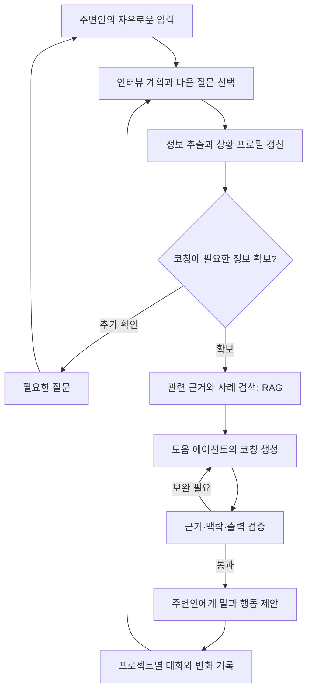

# HOP Biohealth AI Challenge

**환자를 돕고 싶은 주변인에게, 관계와 상황에 맞는 말과 행동을 제안하는 AI 코칭 웹앱**

> “친구가 요즘 연락을 피하는데, 어떤 말을 해야 할지 모르겠어요.”

HOP는 가족·친구·연인 등 주변인이 알고 있는 상황을 대화로 정리하고, 그 사람이 일상에서 실천할 수 있는 도움을 구체화하는 프로젝트입니다. 구조화된 인터뷰, 상황에 맞춘 도움 에이전트, 상담 데이터 학습, 근거 자료 검색을 연결하는 서비스를 설계합니다.

현재 저장소에는 재개발을 위한 프로젝트 소개와 설계 방향만 담고 있습니다. 아래 기능과 구조는 개발 계획이며, 구현 코드와 실행 방법은 개발이 진행되면서 추가합니다.

## 1. 누구를 위한 서비스인가요?

| 구분 | 대상과 역할 |
| --- | --- |
| 직접 사용자 | 환자의 상황을 어느 정도 알고 있고 도움을 주고 싶은 주변인 |
| 도움을 받는 대상 | 사용자가 걱정하고 있는 가족·친구·연인 등 |
| AI의 역할 | 주변인의 설명을 정리하고, 관계와 여건에 맞는 대화·행동을 제안하는 도움 에이전트 |
| 주요 사용 상황 | 먼저 연락하기, 걱정되는 변화를 이야기하기, 도움을 제안하기, 지속적인 돌봄의 부담을 조절하기 |

프로젝트가 다루는 문제는 **“도움을 주고 싶지만 어떤 말과 행동이 적절한지 모르겠다”**는 어려움입니다. 전문적인 상담·진료 사이의 일상에서 주변인이 할 수 있는 지원을 구체화하고, 주변인 자신의 부담도 함께 고려합니다.

## 2. 사용 흐름

1. **프로젝트 만들기** — 대상자의 별칭이나 상황으로 프로젝트를 만들고, 같은 프로젝트에서 대화를 이어갑니다.
2. **도움 요청하기** — 사용자가 현재 걱정과 원하는 도움을 자유롭게 입력합니다.
3. **필요한 질문 받기** — 에이전트가 17개 기본 문항 중 아직 확인하지 못한 정보를 질문합니다.
4. **상황 구조화하기** — 답변에서 관계, 관찰된 변화, 생활환경, 기존 대처, 필요한 도움을 정리합니다.
5. **도움 에이전트 구성하기** — 확보한 정보와 관계에 맞춰 코칭의 말투, 목표, 제안 범위를 설정합니다.
6. **근거를 참고한 코칭 받기** — 관련 자료를 검색하고, 실제로 건넬 말과 작은 행동을 제안합니다.
7. **변화 기록하기** — 이후 반응과 상황 변화를 반영해 다음 대화를 이어갑니다.

예를 들어 연락을 피하는 친구를 걱정하는 사용자에게는, 먼저 관계와 관찰한 변화·현재의 걱정을 확인합니다. 충분한 맥락이 모이면 연락 문구, 부담을 줄이는 도움 제안, 다음에 확인할 내용을 상황에 맞춰 제공합니다. 한 번의 발언만으로 상태나 원인을 확정하지 않습니다.

## 3. 17문항 기반의 적응형 인터뷰

질문 구성은 미국정신의학회 **APA의 Cultural Formulation Interview(CFI) — Informant Version**을 참고합니다. 해당 자료는 주변인의 관점에서 문제의 의미, 생활 맥락, 지원과 도움에 대한 기대를 파악하는 인터뷰입니다. 팀에서 한국어 서비스 문항으로 재구성하며, 공식 한국어 번역이나 검증된 증상 점수 척도로 표시하지 않습니다. [APA 원문](https://www.psychiatry.org/File%20Library/Psychiatrists/Practice/DSM/APA_DSM5_Cultural-Formulation-Interview-Informant.pdf)

| 영역 | 문항 | 확인할 정보 |
| --- | --- | --- |
| A. 대상자와의 관계 | 1 | 관계, 만남·연락 빈도 |
| B. 현재 겪는 어려움 | 2–4 | 주변인이 이해하는 어려움, 다른 사람에게 설명하는 방식, 가장 큰 걱정 |
| C. 원인과 생활환경 | 5–8 | 영향을 준 경험·상황, 주변의 해석, 도움이 되는 자원, 생활 속 부담 |
| D. 생활 배경과 가치관 | 9–11 | 중요하게 여기는 배경·가치관, 현재 어려움과의 관계, 추가로 고려할 점 |
| E. 지금까지의 대처와 도움 | 12–14 | 스스로 해 온 대처, 받은 도움, 도움을 받는 데 생긴 장벽 |
| F. 현재 필요한 도움 | 15–17 | 필요한 지원, 주변에서 권한 도움, 상담·진료 시 배려할 사항 |

### 모든 질문에 답해야 하나요?

17문항은 정보를 수집하는 기본 틀입니다. 사용자의 한 답변에 여러 문항의 정보가 포함되어 있으면 이미 확인된 질문을 반복하지 않도록 설계합니다.

코칭으로 전환할 때는 답변의 길이보다 **필요한 정보가 확보되었는지**를 확인합니다. 관계, 현재 어려움, 가장 큰 걱정, 원하는 도움을 중심으로 필요한 맥락을 점검하고, 불명확하거나 서로 충돌하는 내용은 추가로 확인합니다. 사용자가 모르는 내용은 미확인 상태로 유지하며, 부족한 정보가 있는 경우 제안의 범위를 조절합니다.

구체적인 전환 기준은 대표 사례와 사용자 평가를 통해 정합니다.

## 4. 상황 프로필과 도움 에이전트의 페르소나

**상황 프로필**은 사용자가 제공한 정보를 구조화한 기록입니다. **도움 에이전트의 페르소나**는 이 기록을 바탕으로 정하는 코칭 방식입니다.

| 상황 프로필에 담을 내용 | 코칭에 활용하는 방법 |
| --- | --- |
| 대상자와의 관계·접촉 빈도 | 자연스럽게 사용할 말투와 가능한 도움의 범위 조절 |
| 관찰한 변화·현재 걱정 | 우선 확인할 내용과 대화 목표 설정 |
| 생활환경·가치관·선호 | 대상자가 부담을 덜 느낄 표현과 제안 선택 |
| 지원 자원·기존 대처·도움의 장벽 | 현실적으로 실행할 수 있는 다음 행동 제안 |
| 사용자의 감정·돌봄 부담 | 사용자가 감당할 수 있는 도움의 범위 고려 |
| 정보의 출처·미확인 항목 | 추측을 줄이고 필요한 확인 질문 생성 |

직접 관찰한 사실, 대상자에게 들은 말, 사용자의 해석을 구분하고 근거가 된 발언과 연결합니다. 대상자의 상황과 사용자의 감정을 별도로 기록하며, 새 정보가 들어오면 이전 기록과 함께 갱신합니다.

페르소나는 환자의 성격이나 내면을 단정하는 프로필이 아니라, **해당 관계에서 도움이 되는 방식으로 반응하도록 설정한 에이전트의 역할**을 뜻합니다.

## 5. 에이전트와 모델 구성

다음은 개발할 전체 흐름입니다.



| 역할 | 주요 작업 | 기대 출력 |
| --- | --- | --- |
| 계획·정보 추출 | 인터뷰 진행 상태 확인, 발언 구조화, 추가 질문 선택 | 상황 프로필, 확인할 정보, 질문 또는 코칭 전환 결정 |
| 코칭 생성 | 프로필·관계·검색 근거를 반영한 답변 작성 | 건넬 말, 실행할 행동, 배려할 점, 참고 근거 |
| 중간 검증 | 답변이 입력·근거와 일치하는지, 과도한 추정이 있는지 점검 | 통과 여부, 수정할 부분 |

최대 세 개의 모델을 활용하는 구성을 검토합니다. 우선 하나의 모델에 역할별 프롬프트를 적용하는 방식과 모델을 분리하는 방식을 비교하고, 품질·응답 시간·GPU 메모리에 맞춰 결정합니다. 검증 후 재생성 횟수에도 상한을 둡니다.

일반 모델을 기준선으로 평가하고 Gemma 계열 등의 파인튜닝 모델과 비교할 계획입니다. 출력의 일관성은 구조화된 출력 형식과 검증으로 확인하며, 긴 대화는 저장된 이력·요약·상황 프로필을 함께 사용하는 방식으로 설계합니다. 모델 크기만으로 출력 안정성이나 장기 기억을 보장한다고 가정하지 않습니다.

프로젝트 자동 제목은 작은 CPU 모델이나 규칙 기반 방식으로 분리하는 방안도 검토합니다.

## 6. 상담 데이터와 학습 계획

팀에서 전처리 중인 상담 데이터는 **전체 대화·문단·단어 단위의 세 가지 구성**입니다. 내담자와 상담사의 발언 및 기존 라벨을 활용하고, 문장·단어 수준의 세부 정보를 연결해 학습 자료를 구성할 계획입니다.

```text
긴 상담 대화와 기존 라벨
  → 발화자와 대화 순서 정리
  → 문단·문장·단어 단위 분할 및 원문 연결
  → 기존 라벨 보존 + 세부 라벨 검토
  → 정보 추출·질문 선택·응답 작성용 학습 예시 구성
  → 일반 모델과 파인튜닝 모델 비교 평가
```

- 각 조각에 원래 대화·발화자·위치 정보를 연결해 문맥을 유지합니다.
- 자동 분류나 LLM이 생성한 라벨은 검토 대상임을 표시하고, 원래 제공된 라벨과 구분합니다.
- 같은 상담 대화에서 나온 문단과 단어가 학습·평가 세트에 나뉘어 들어가지 않도록 원본 대화 단위로 분리합니다. 동일 대상자를 식별할 수 있다면 대상자 단위 분리도 적용합니다.
- 실제 상담 대화와 주변인의 도움 요청은 입력 관점이 다르므로, 주변인 시나리오를 별도로 구성해 적합성을 평가합니다.
- 데이터별 출처·이용 조건·라벨 정의를 정리하고, 식별 정보를 제거한 자료만 학습·검색 대상으로 검토합니다.

대표 사례를 프롬프트에 제공하는 방식, RAG로 관련 사례를 검색하는 방식, 파인튜닝을 적용하는 방식을 비교합니다. 데이터셋 이름·규모·분포와 성능 수치는 확인된 결과가 있을 때 추가합니다.

## 7. RAG와 근거 자료

RAG는 질문과 상황에 관련된 자료를 검색해 코칭에 제공하는 역할을 맡습니다. 자료의 성격을 구분해 답변에 활용합니다.

| 자료 종류 | 활용 목적 | 함께 관리할 정보 |
| --- | --- | --- |
| 상담 대표 사례 | 질문 방식과 대화 표현 참고 | 사례 출처, 라벨, 원문 맥락, 검토 여부 |
| 전문기관의 지원 지침 | 주변인이 실천할 수 있는 지원 방법 참고 | 기관, 발행·갱신일, 적용 대상, 원문 링크 |
| 연구 논문·척도 자료 | 평가 방법과 개입 근거 검토 | 연구 대상, 측정 도구, 결과, 적용 한계 |

주변인의 불안·죄책감·돌봄 부담에 관한 자료도 별도로 구성할 계획입니다. 상담 사례의 표현과 연구가 뒷받침하는 효과를 구분하고, 검색한 자료가 해당 상황에 맞는지 확인한 뒤 사용합니다. 관련 근거가 부족하면 추가 질문을 하거나 답변 범위를 제한합니다.

아래 참고 자료는 **설계를 위한 근거 목록**입니다. 검색 데이터베이스 구축이나 임상적 효과 검증이 완료되었다는 의미는 아닙니다.

## 8. 상태 분류와 수치화의 기준

우울·불안·중독·기타는 대화에서 관련 주제를 정리하기 위한 분류 후보입니다. 여러 영역이 함께 나타날 수 있고, 확인할 정보가 부족할 수도 있으므로 단일 범주로 강제하지 않는 방향을 검토합니다.

**대화 분류 결과, 정보 수집 정도, 임상 척도 점수는 각각 별도로 다룹니다.**

| 구분 | 의미 | 적용 방향 |
| --- | --- | --- |
| 정보 수집 정도 | 코칭에 필요한 항목을 얼마나 확인했는지 | 인터뷰 진행과 추가 질문 선택에 활용 |
| 대화 분류 결과 | 발언이 어떤 주제·상태 단서와 관련되는지 | 근거 발언과 함께 표시하고 분류 성능 평가 |
| 임상 척도 점수 | 정해진 문항·응답·채점 절차로 산출한 값 | 해당 척도의 적용 대상과 사용 조건을 확인한 경우에만 검토 |

우울 증상에는 PHQ-9, 범불안 증상에는 GAD-7처럼 연구된 도구가 있습니다. 두 도구의 원 연구는 자기보고 방식의 평가를 다룹니다. 이 프로젝트에서는 주변인의 자유 대화를 해당 점수로 자동 환산하지 않으며, 별도의 적합성 검토가 필요합니다. [PHQ-9 원 연구](https://pmc.ncbi.nlm.nih.gov/articles/PMC1495268/), [GAD-7 원 연구](https://pubmed.ncbi.nlm.nih.gov/16717171/)

AUDIT는 음주 문제에 관한 도구이므로 중독 전반을 하나의 점수로 나타내는 근거로 사용하지 않습니다. 기타 범주에도 하나의 공통 척도가 있다고 가정하지 않습니다. [WHO AUDIT 안내](https://www.who.int/publications/i/item/WHO-MSD-MSB-01.6a)

논문에 제시된 집단 수준의 결과를 특정 대상자의 개선 확률이나 예상 치료 효과로 바꾸어 제시하지 않습니다. 우선 목표는 **주변인이 이해하고 실행할 수 있는 코칭을 근거와 함께 제공하는 것**이며, 실제 변화와 효과는 별도 평가로 확인합니다.

## 9. 웹앱 개발 방향

| 영역 | 계획 |
| --- | --- |
| 프론트엔드 | 프로젝트 목록, 대화형 인터뷰, 확인된 상황 요약, 코칭과 근거 표시 |
| 백엔드 | Node.js·TypeScript 기반 인증, 프로젝트·대화 관리, 질문 흐름, 모델·검색 연동 |
| 데이터베이스 | PostgreSQL에 사용자, 프로젝트, 대화, 프로필 변경 이력, 근거 메타데이터 저장 |
| 모델 서빙 | 4090 환경에서 모델 크기·양자화·문맥 길이·동시 요청에 따른 실행 가능성 확인 |
| 팀 접근 | 이메일·비밀번호 로그인과 초대 기반 접근 |
| 연동 계약 | API 입출력, 인증 방식, 대화 상태와 오류 처리를 프론트엔드와 먼저 합의 |

프로젝트별 대화 기록을 이어서 사용하고, 다른 프로젝트의 정보가 섞이지 않도록 설계합니다. 원본 상담 데이터, 모델 가중치, 비밀번호와 실제 사용자 대화는 저장소에 올리지 않습니다.

## 10. 개발·검증 순서

1. 17문항의 표현과 정보 구조, 코칭 전환 기준을 합의합니다.
2. 주변인 입력에 대한 대표 시나리오와 기대 결과를 작성합니다.
3. API 계약과 PostgreSQL 구조를 정하고 로그인·프로젝트·대화 흐름을 구현합니다.
4. 일반 모델의 정보 추출·질문 선택·코칭·검증을 연결합니다.
5. 출처를 확인한 자료로 RAG를 구성하고 답변의 근거를 확인합니다.
6. 파인튜닝 모델을 같은 평가 세트에서 비교하고 프론트엔드를 연동합니다.

평가에는 정보 추출 정확도, 근거 없는 추정, 반복 질문, 적절한 코칭 전환, 관계에 맞는 표현, 검색 근거와 답변의 일치, 응답 시간과 출력 형식 준수를 포함합니다. 사용자의 정정, 서로 충돌하는 진술, 모르는 내용, 긴 대화, 주변인 자신의 부담, 즉각적인 위험을 시사하는 입력도 별도로 점검합니다.

즉각적인 위험을 시사하는 경우에는 일반 코칭보다 적절한 긴급 지원 연결을 우선하는 흐름을 설계합니다. 서비스의 유용성과 증상 개선 효과는 구분해 평가합니다.
